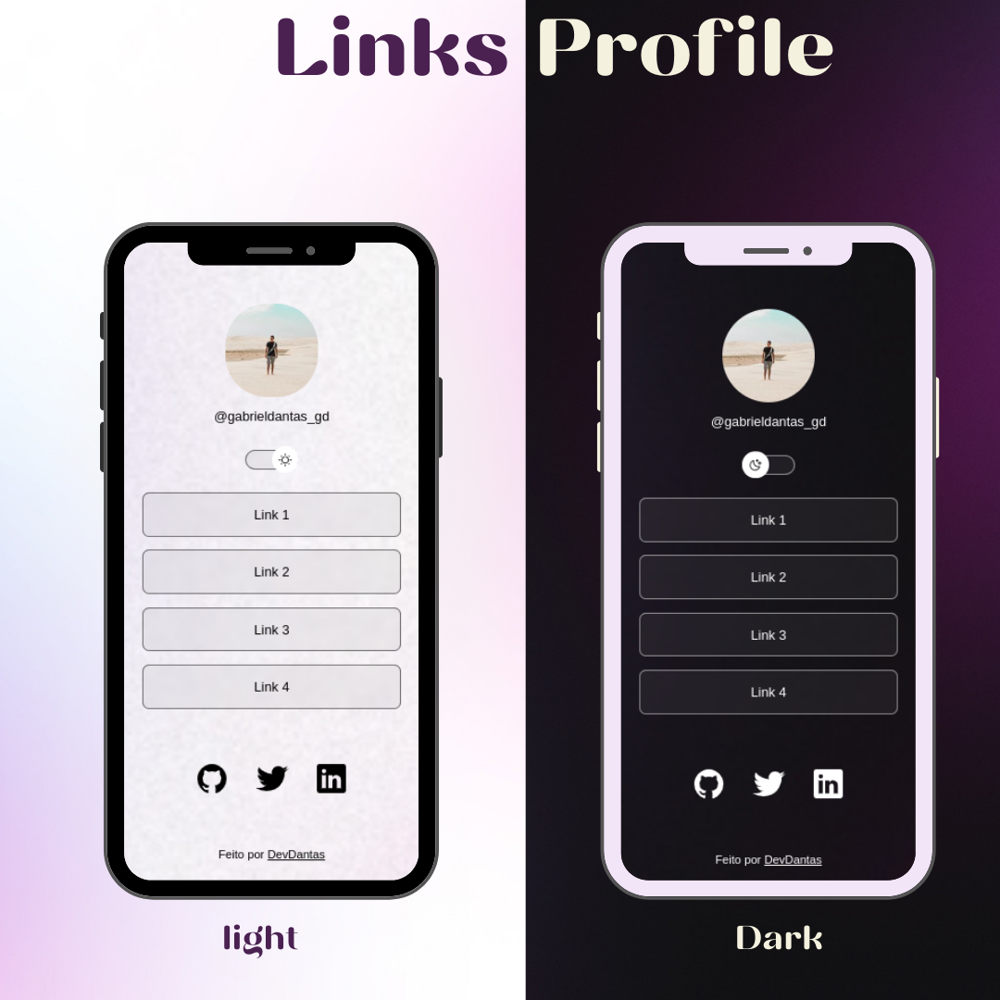

<h1 align="center"> ProfileDev </h1>

  <a href="#-tecnologias">Tecnologias</a>&nbsp;&nbsp;&nbsp;|&nbsp;&nbsp;&nbsp;
  <a href="#-projeto">Projeto</a>&nbsp;&nbsp;&nbsp;|&nbsp;&nbsp;&nbsp;
  <a href="#-layout">Layout</a>&nbsp;&nbsp;&nbsp;|&nbsp;&nbsp;&nbsp;
  <a href="#memo-licença">Licença</a>

  

 

## 🚀 Tecnologias

Esse projeto foi desenvolvido com as seguintes tecnologias:

- HTML e CSS
- JavaScript
- Git e Github
- Figma

## 💻 Projeto

O ProfileDev é um agregador de links para usar como cartão de visitas online.

- [Acesse o projeto, online](https://maykbrito.github.io/devlinks)

## :memo: Licença

Esse projeto está sob a licença MIT.

---

 

 Feito com ♥ by devDantas 
